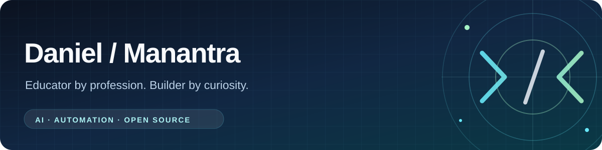

  

**Educator by profession. Builder by curiosity.**

I build practical tools, untangle complicated systems, and contribute to open source.

## 👋 Hi, I'm Daniel

I work in **education and school social work** in Germany. Outside of that, I enjoy building software that solves everyday problems — especially where **AI, Home Assistant, automation, and self-hosted tools** meet.

My favorite projects make complex systems **easier to understand**, repetitive work **less tedious**, and technology **more useful without taking control away from its users**. I build my own tools, but I also enjoy making the open-source projects I use a little better.

## 🚀 Featured projects

These are projects and research efforts I maintain under **Manantra** — not just forks of someone else's code.

### 🏠 [HA Lens](https://github.com/Manantra/ha-lens) · Home Assistant automation insights

**See what an automation does, why it runs, and which path it takes.**

A read-only visualizer and analyzer that turns Home Assistant automation YAML into understandable flow graphs, possible execution paths, entity references, and diagnostic insights. Its Home Assistant companion can also display the latest execution trace — **without changing or executing automations**.

`TypeScript` · `React` · `Home Assistant` · `YAML analysis`

### 🧠 [CortexGate](https://github.com/Manantra/cortexgate) · AI content, with a human checkpoint

A mobile-friendly dashboard for reviewing and curating **AI-generated summaries** before saving them to an **Obsidian** knowledge base. Built around a simple idea: automate the collection, keep a person in charge of what gets saved.

`JavaScript` · `PWA` · `Obsidian` · `OpenClaw`

### 🔬 [Echo Dot / Crumpet Research](https://github.com/Manantra/echo-dot-crumpet-research) · Evidence-led reverse engineering

Public, **read-only research** into the Echo Dot 3rd Gen Refresh (Crumpet): firmware structure, boot-chain behavior, and hardware-specific constraints. The documentation distinguishes **verified findings from hypotheses**; it does not claim an established unlock or root method.

`Python` · `Firmware research` · `Documentation`

### ☀️ Smaller tools for everyday workflows

- **[Morning Dashboard](https://github.com/Manantra/morning-dashboard)** — an OpenClaw skill that combines weather, calendar events, tasks, and birthdays into a daily briefing.
- **[People CRM](https://github.com/Manantra/people-crm)** — an OpenClaw skill for organizing personal contacts, relationships, notes, and birthdays.

## 🤝 Open-source contributions

One of my favorite parts of building is contributing improvements **back to the original projects**. Below are selected upstream pull requests, with merged contributions and other proposals distinguished.

### 🌙 [Moonfin](https://github.com/Moonfin-Client/Roku) · Roku client for Jellyfin & Emby

**Selected merged pull requests** across server compatibility, playback, and multi-server behavior:

| Area | Merged contributions |
| :-- | :-- |
| **Emby support** | [Server integration, Connect login, and playback compatibility · #277](https://github.com/Moonfin-Client/Roku/pull/277) |
| **Jellyfin & playback** | [Music routes and remote trailers · #281](https://github.com/Moonfin-Client/Roku/pull/281), [series/season resume · #282](https://github.com/Moonfin-Client/Roku/pull/282), [Live TV remux retries · #283](https://github.com/Moonfin-Client/Roku/pull/283) |
| **Correct server context** | [Video playback · #284](https://github.com/Moonfin-Client/Roku/pull/284), [audio playback · #285](https://github.com/Moonfin-Client/Roku/pull/285), [detail actions · #286](https://github.com/Moonfin-Client/Roku/pull/286) |

*Also submitted:* [Windows-root-path handling for Seerr · #301](https://github.com/Moonfin-Client/Roku/pull/301) and a [season-display toggle · #302](https://github.com/Moonfin-Client/Roku/pull/302).

### 🧠 [claude-mem](https://github.com/thedotmack/claude-mem) · Installer and OpenClaw compatibility

**Merged pull requests** helping keep integrations reliable:

- [Preserve `openclaw.extensions` during installation · #1113](https://github.com/thedotmack/claude-mem/pull/1113)
- [Use the expected OpenClaw command-handler response · #1115](https://github.com/thedotmack/claude-mem/pull/1115)
- [Respect existing installer and plugin-load paths · #1116](https://github.com/thedotmack/claude-mem/pull/1116)

### 🏡 [Parqet Companion](https://github.com/cubinet-code/ha-parqet-companion) · Home Assistant portfolio integration

- **Merged:** [Support multiple Parqet accounts · #7](https://github.com/cubinet-code/ha-parqet-companion/pull/7)
- **Submitted:** [Optimize API requests and cache calendar activity · #10](https://github.com/cubinet-code/ha-parqet-companion/pull/10) and [localize cards in German · #11](https://github.com/cubinet-code/ha-parqet-companion/pull/11)

### 🤖 Other upstream proposals

- **[Hermes Agent](https://github.com/NousResearch/hermes-agent):** [Serialize concurrent dependency installs · #84766](https://github.com/NousResearch/hermes-agent/pull/84766) and [scope Kanban tool availability to agent context · #84816](https://github.com/NousResearch/hermes-agent/pull/84816)
- **[Hermex](https://github.com/uzairansaruzi/hermex):** [Display transcript audio as voice bubbles · #44](https://github.com/uzairansaruzi/hermex/pull/44) *(submitted; closed without merge as of October 2026)*

The hand-picked links above reflect contributions verified in October 2026. The automatically generated section below tracks newly merged PRs.

## 📡 Latest GitHub activity

<!-- PROFILE_ACTIVITY:START -->
### Recently merged upstream contributions

Recent upstream contributions will be populated by the scheduled GitHub workflow after setup.

### Recently active original repositories

Recently active original repositories will be populated by the scheduled GitHub workflow after setup.
<!-- PROFILE_ACTIVITY:END -->

[How this section is updated](docs/AUTOMATION.md) — changes are proposed as draft PRs, never auto-merged.

## 🧰 Technologies & interests

  
  
  
  
  
  
  
  

**Things I'm drawn to:** smart-home troubleshooting, visual explanations, AI-assisted workflows, knowledge management, local-first software, and useful tools that can be self-hosted.

I also explore and adapt existing software through [forks and experiments](https://github.com/Manantra?tab=repositories). **A fork on its own isn't an upstream contribution** — that's why the section above links to actual pull requests.

## 💡 My approach

> Build useful things. Make them understandable. Keep people in control.

A small, well-documented fix that helps real people can be just as valuable as a big new project.

---

  <strong>Thanks for stopping by.</strong> 
  <a href="https://github.com/Manantra?tab=repositories">Explore my repositories</a> ·
  <a href="https://github.com/pulls?q=is%3Apr+author%3AManantra">Browse my pull requests</a>

